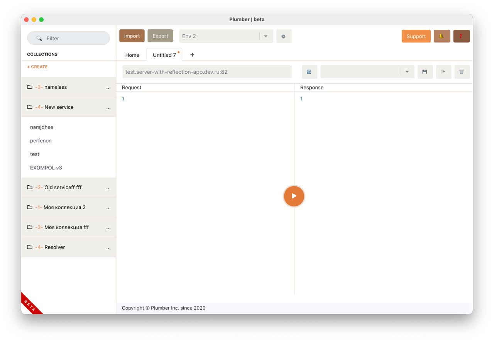

<p align="center">
  
</p>
<h1 align="center">Plumber</h1>

<p align="center">
    
  
  <a href="https://pshktrck.ru/plumber/">
    
  </a>
  <a href="https://t.me/plumberpc">
    
  </a>  
</p>

<p align="center">Like Postman, just for GRPC</p>
<p align="center">Thanks <a href="https://github.com/warmuuh/milkman">Milkman</a> and <a href="https://github.com/uw-labs/bloomrpc">Bloom</a> for inpiration.</p>


## About
I just create a GUI for [GRPCurl](https://github.com/fullstorydev/grpcurl). This is a attempt at creating a simple tool that can speed up GRPC ervises testing process.

<p align="center"></p>

## ⚡ Important
> This version doesn't support import proto files or protosets yet (will be).  
> You can use it only with servers, which support reflection API.

## Features
...

## Build and launch 🚀

### requirenments
- Node.js
- Python3
- Python2
- xcode (or xcode-tools) for MacOS

### Now, build
```bash
- brew install grpcurl (MacOS)
- git clone https://github.com/pashkatrick/Plumber/
- cd Plumber
- pip install virtualenv
- virtualenv venv2
- source venv2/bin/activate
- npm install
- npm run npm-install
- deactivate
- npm start
```

## Dev / Contribution 🚀
For development python backend part, you need (in this directory):
```bash
- python3 -m venv venv
- source venv/bin/activate
- pip install -r requirements.txt
- deactivate
```
Then create or set data to your .env ([example](https://github.com/pashkatrick/Plumber/blob/tcp-move/env-example), [details](https://pypi.org/project/python-decouple/#usage)), and after that:
```
- python3 app.py
```
You can use second instanse of termial, to execute first test command:
```bash
zerorpc tcp://localhost:1111 test
```
